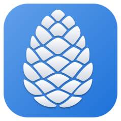

# ttyga

The terminal launcher that remembers where you go.

ttyga is a GTK4 terminal for GNOME with a profile sidebar. Instead of digging through shell history or a notes file, you keep profiles — click one and a new tab opens straight into an SSH session, a command ready to review, or a script that runs immediately.



## Features

- **Profile sidebar** — SSH connections, shell commands, and clippets organised into groups
- **Split panes** — split any tab horizontally or vertically; SSH panes reconnect to the same host
- **Profile variables** — prompts for values at launch time, with defaults and history
- **Session persistence** — tab layout and pane splits are restored on next launch
- **Profile inheritance** — profiles can inherit from a base profile to avoid repetition
- **Colour and icon per profile** — colour-coded dots and icons in both the sidebar and tab labels

## Requirements

- Python 3.10+
- GTK 4 / Adwaita / VTE (`python3-gi`, `gir1.2-gtk-4.0`, `gir1.2-adw-1`, `gir1.2-vte-2.91`)
- PyYAML (`python3-yaml`)

On Debian/Ubuntu:

```
sudo apt install python3-gi gir1.2-gtk-4.0 gir1.2-adw-1 gir1.2-vte-2.91 python3-yaml
```

## Install

```
git clone https://github.com/UVicHCMC/ttyga.git
cd ttyga
./install.sh
```

This copies `ttyga` to `~/.local/bin`, installs the icon, registers the `.desktop` file, and seeds `~/.config/ttyga/profiles.yaml` from the example on first run.

To uninstall: `./install.sh --uninstall`

## Configuration

Profiles live in `~/.config/ttyga/profiles.yaml`. See [`profiles.yaml.example`](profiles.yaml.example) for a working reference, and [`TTYGA_TECH.md`](TTYGA_TECH.md) for the full field reference.

## Documentation

- [`TTYGA.md`](TTYGA.md) — user guide
- [`TTYGA_TECH.md`](TTYGA_TECH.md) — power-user reference: full YAML schema, classifier titles, variables, split pane details

## Licence

GPL v3 — see [LICENSE](LICENSE).
